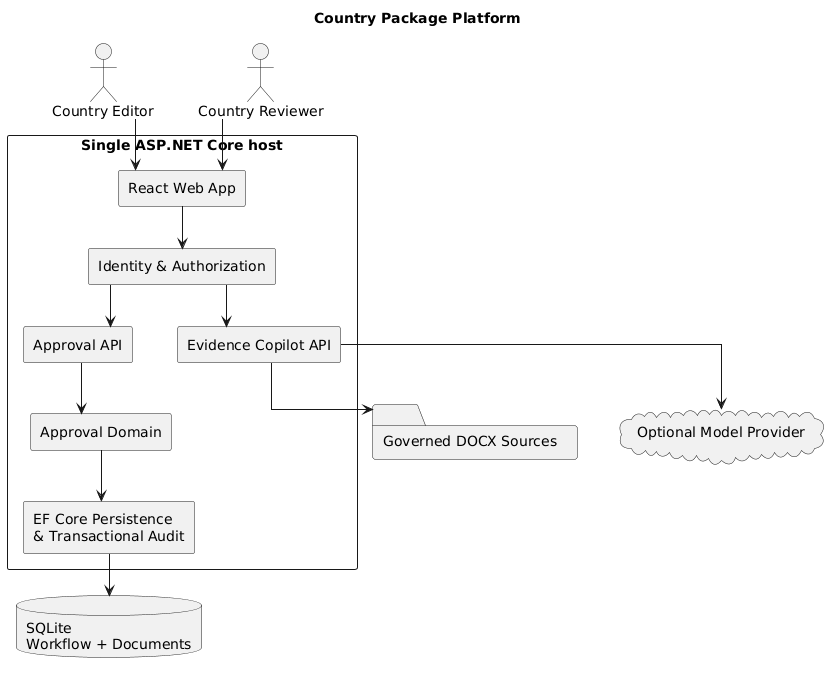
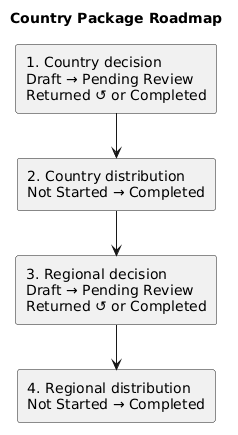
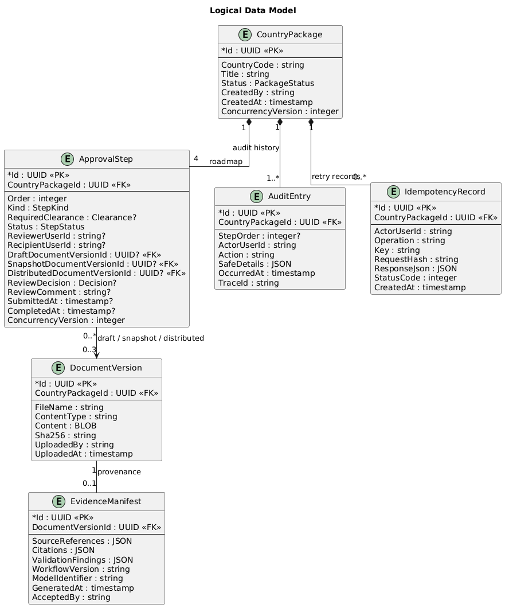
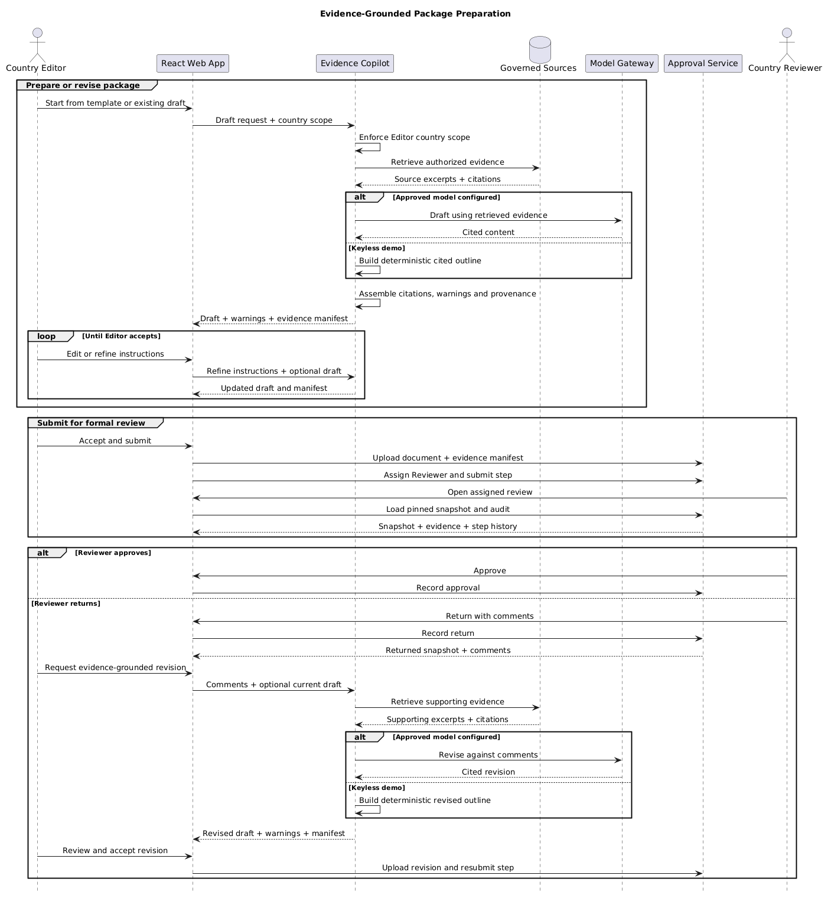
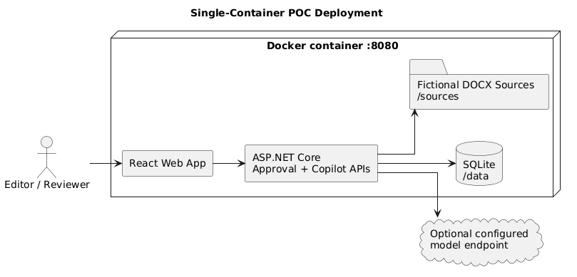

# Country Package Approval Service

## 1. Solution overview

Country teams prepare Country Packages that must be reviewed, approved, and distributed at country and regional management levels. This implementation provides a role-aware React workspace, a deterministic ASP.NET Core approval service, and an evidence-grounded authoring assistant in one runnable container.

The application has two roles:

- **Country Editor** — creates country-scoped packages, prepares and uploads documents, selects the required stakeholder, and submits each roadmap step.
- **Country Reviewer** — sees only assigned pending decisions and approves the pinned snapshot or returns it with a comment.

Every package receives the same four-step roadmap. Immutable document versions preserve exactly what each reviewer saw, while workflow state, audit entries, and idempotency results commit in one SQLite transaction.

## 2. Run the solution

### Evaluator quick start

The only prerequisite is Docker Desktop, or Docker Engine with the Compose plugin. The host does **not** need .NET, Node.js, SQLite, an AI subscription, or an API key.

From the repository root, run:

```bash
docker compose up --build
```

The first build requires internet access. Docker downloads the pinned Node 22 and .NET 8 build/runtime images, then restores the npm and NuGet dependencies declared by the checked-in lock/project files. These downloads are cached for later runs.

Wait until the container reports `Application started`, then open:

- [http://localhost:8080](http://localhost:8080) — application and fictional persona login;
- [http://localhost:8080/swagger](http://localhost:8080/swagger) — interactive API contract;
- [http://localhost:8080/health/ready](http://localhost:8080/health/ready) — readiness check.

The login screen supplies the Development personas needed to exercise Editor and Reviewer flows. Evidence Copilot uses its deterministic local gateway by default, so the complete demo works without external credentials or paid model calls.

The container serves the React production build and all APIs on port `8080`. Its named `/data` volume preserves the SQLite database and document BLOBs across restarts.

Stop the application while retaining its data:

```bash
docker compose down
```

To remove the container and reset all exercise data, including the named SQLite volume:

```bash
docker compose down --volumes
```

### Optional local development

For local development with .NET 8 and Node 22:

```bash
npm --prefix src/CountryPackage.Web ci
npm --prefix src/CountryPackage.Web run build
dotnet run --project src/CountryPackage.Api
```

## 3. Architecture



The single runtime keeps deployment simple without collapsing the logical boundaries:

| Component | Responsibility |
|---|---|
| React web application | Development persona selection, Editor roadmap/workspace, Reviewer task list, review view, and Copilot editor |
| Approval API and domain | Resource-aware authorization, fixed roadmap transitions, assignments, snapshots, distribution, retries, and concurrency |
| Evidence Copilot module | Authorized DOCX retrieval, bounded drafting and revision, citations and warnings, evidence manifests, and DOCX export |
| Identity boundary | Maps the Development `X-User-Id` to role, country scopes, and organizational clearance |
| EF Core persistence | SQLite migrations, immutable document BLOBs, append-only audit, and idempotency records |

The Approval domain is the only authority for workflow mutations. Copilot output remains ordinary Editor-controlled content: it cannot select stakeholders, submit, approve, return, or distribute a package.

## 4. Workflow and data

### Approval roadmap



| Order | Step | Behavior |
|---:|---|---|
| 1 | Country decision | Upload a document, assign a country-level Reviewer, and submit the pinned snapshot |
| 2 | Country distribution | Select a country-level recipient and distribute the step 1 approved snapshot |
| 3 | Regional decision | Reuse or revise the approved document, assign a regional Reviewer, and submit |
| 4 | Regional distribution | Select a regional recipient and distribute the step 3 approved snapshot |

Later steps are blocked until earlier steps complete. Returning a decision preserves its submitted snapshot and comment; the Editor may upload a new immutable version or resubmit the existing draft. Country distribution initializes the regional decision from the approved country snapshot, so revision is optional. A later regional version never changes the earlier country decision evidence.

### Logical data model



`CountryPackage` owns exactly four `ApprovalStep` records. Steps reference immutable `DocumentVersion` rows as draft, review snapshot, or distributed evidence. `AuditEntry` is append-only; `IdempotencyRecord` stores successful command responses; application-managed concurrency versions reject competing transitions. An Editor-accepted AI artifact may carry one `EvidenceManifest` recording source references, citations, warnings, workflow/model identifiers, generation time, and the server-derived accepting user.

The business transition, corresponding audit effect, and idempotency result are saved together. A failure before commit rolls back the entire action.

## 5. Evidence-grounded authoring



The core AI use case is preparing a submission-ready Country Package from governed evidence. The bounded workflow supports initial drafting and evidence-guided revision after Reviewer comments:

1. enforce the Editor's country scope before retrieval;
2. extract paragraphs from matching fictional DOCX sources and rank them against the request;
3. generate a cited draft through the configured model gateway, or a deterministic evidence outline in the keyless demo;
4. return citations, warnings, and an evidence manifest;
5. require the Editor to edit and explicitly accept the artifact before upload.

The repository includes fictional BGD and KEN DOCX sources. By default, the gateway uses a deterministic local generator so the exercise runs without credentials or paid network calls. Compose maps the optional `COPILOT_MODEL_ENDPOINT`, `COPILOT_MODEL`, `COPILOT_API_KEY`, and `COPILOT_API_KEY_HEADER` host variables to the model gateway; use `api-key` as the header value for an Azure-style key. Provider failure affects authoring only—the Approval workflow remains available.

Responsible-AI controls include authorization before model context construction, country-tagged sources, visible citations and evidence gaps, bounded inputs and timeouts, no approval tools, human acceptance, and retained provenance. Production ingestion would add PDF extraction, classification metadata, malware scanning, source lifecycle controls, and evaluation gates.

## 6. Security and API

### Authorization model

| Capability | Country Editor | Country Reviewer |
|---|---|---|
| Create a package | Country in scope | No |
| Upload or revise a document | Eligible decision step in scope | No |
| Submit a decision or distribution | Valid in-scope Reviewer or recipient | No |
| List review tasks | No | Own pending assignments only |
| Approve or return | No | Assigned pending decision with exact scope and clearance |
| Read package, document, or audit | All package resources in country scope | Assigned pending snapshot and step context only |
| Use Evidence Copilot | Country in Editor scope | No |

Unreadable resources are concealed with `404`; forbidden actions on visible resources return `403`. Development personas and `X-User-Id` authentication are enabled only in the Development environment. A production deployment replaces them with verified OIDC claims while retaining the same authorization policies.

[`openapi.yaml`](openapi.yaml) is the authoritative Approval and Copilot contract used by the bundled Swagger UI. It covers requests, schemas, examples, development identity, document responses, and consistent `application/problem+json` errors.

Every state-changing Approval command requires an `Idempotency-Key`. A retry with the same canonical request replays the stored result; reusing a key with different input returns `409`. Optimistic concurrency prevents different keys from recording contradictory decisions.

Uploads accept PDF and DOCX up to 10 MB and validate extension, declared content type, size, and file signature. Document contents, extracted evidence, review comments, credentials, and request bodies are excluded from application logs.

## 7. Deployment and operations



The multi-stage Dockerfile builds the React client, publishes ASP.NET Core, and produces one non-root Linux container. Fictional sources are included under `/sources`; the persistent database and uploaded documents live under `/data`.

Operational endpoints:

- `/health/live` — process liveness;
- `/health/ready` — readiness including database connectivity;
- `/swagger` — interactive contract in Development;
- `/openapi.yaml` — the checked-in machine-readable contract.

Structured logs go to standard output. Configuration uses environment variables, and the container has a readiness-based health check. Production evolution keeps the domain unchanged while replacing adapters:

| POC | Example production substitution |
|---|---|
| Development personas | Microsoft Entra ID/OIDC and managed identities |
| SQLite document BLOBs | Azure SQL/PostgreSQL plus Blob Storage |
| Bundled DOCX repository | Governed object-storage containers and ingestion workers |
| In-process retrieval | Azure AI Search or another metadata-filtered retrieval index |
| Configurable model gateway | Approved Azure AI Foundry/OpenAI-compatible deployment |
| Console logs | OpenTelemetry with Azure Monitor/Application Insights |
| Environment secrets | Key Vault or the approved secret manager |

Equivalent managed or self-hosted services remain valid. Selection should follow enterprise standards, data residency, SLA, security, maturity, and total cost rather than leaking provider choices into the domain.

## 8. Tests and project structure

Run all automated checks:

```bash
dotnet test --configuration Release
npm --prefix src/CountryPackage.Web run lint
npm --prefix src/CountryPackage.Web test
```

Backend integration tests cover the full four-step HTTP flow, return/resubmit, immutable historical snapshots, role and country failures, Reviewer concealment, idempotent replay, concurrent decisions, transactional audit rollback, authorized retrieval, and valid DOCX export. UI tests protect roadmap presentation and action-state rules.

```text
src/CountryPackage.Api/       ASP.NET Core host, domain, EF Core, Copilot, migrations
src/CountryPackage.Web/       React and TypeScript workspace
tests/CountryPackage.Tests/   HTTP/SQLite integration tests
sources/                      Fictional governed DOCX evidence
diagrams/                     Rendered architecture diagrams
Dockerfile                    Single-container multi-stage build
compose.yaml                  Port and persistent-volume configuration
```

## 9. Key decisions

| Decision | Rationale |
|---|---|
| One container, modular code | One-command evaluation while preserving a future split between deterministic approval and AI authoring |
| Fixed roadmap in the domain | Four known steps do not justify a workflow engine |
| SQLite and BLOBs | Self-contained relational transactions for the POC |
| Immutable versions and pinned snapshots | Preserve the exact artifact associated with every decision |
| Header identity in Development only | Makes RBAC easy to exercise without presenting it as production authentication |
| Deterministic model fallback | Keeps tests and the default demo reliable, offline, and cost-free |
| Checked-in OpenAPI | Gives reviewers a stable API collection and Swagger test surface |
